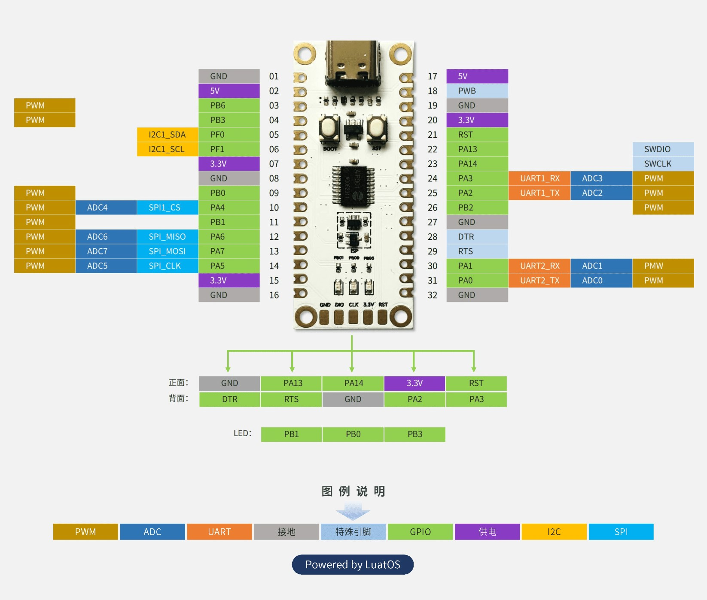

# Air001 Demo

## 搭建开发环境

开发环境搭建参照 [官方教程](https://wiki.luatos.com/chips/air001/Air001-MDK.html) ，官方SDK [在此下载](https://gitee.com/openLuat/luatos-soc-air001) 。

需要注意的是HAL库中的硬件SPI似乎是有问题的（该问题尚未得到确认），在air001xx_hal_spi.c文件中
将766行的

```c
__HAL_SPI_DISABLE(hspi);
```

移动到785行

```c
if (hspi->Init.Direction == SPI_DIRECTION_1LINE)
{
    /* Disable SPI peripheral */
	__HAL_SPI_DISABLE(hspi);
	SPI_1LINE_TX(hspi);
}
```




